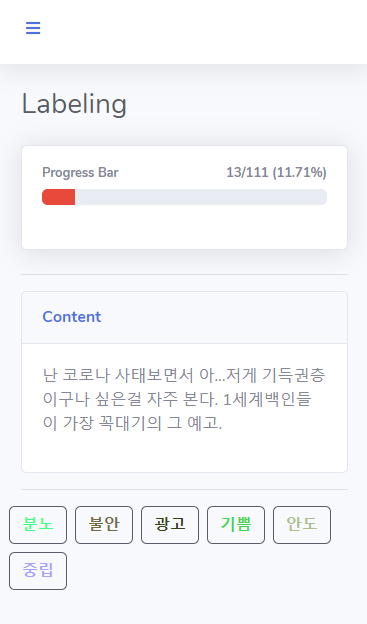
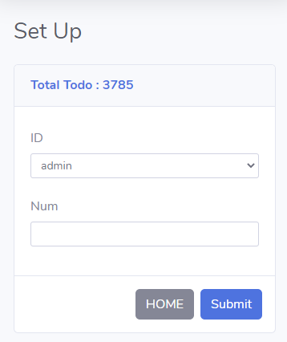
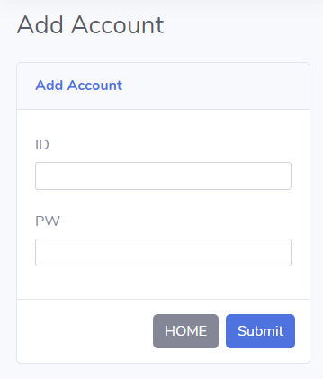
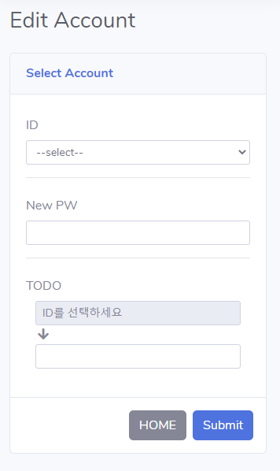
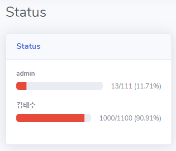

## Labeling

#### 목표
- 딥러닝 학습 데이터로 필요한 labeling 된 데이터 생성
- sns 게시글의 **감정을 labeling** 한다.
- **웹 또는 앱**에서 접근하여 sns 게시글 데이터를 labeling 한다.

#### 사전 준비
1. DB(MySQL) 셋팅
    - url
    - id
    - pw
2. 감정을 labeling 할 데이터 
    - 필수 데이터 목록
      - 게시글 날짜
      - 게시글 내용
3. labeling 할 데이터 DB에 저장
    - 스키마

        |  컬럼명 |     타입     |          설명          |
        |:-------:|:------------:|:----------------------:|
        |    id   |  bigint(20)  | 순차적으로 증가하는 id |
        | content |   longtext   |       게시글 내용      |
        |   date  | varchar(255) |       게시글 날짜      |
        | emotion | varchar(255) |        감정 정보 (초기값 null)       |
        |  owner  | varchar(255) |  라벨링 하는 사용자명 (초기값 null)  |
4. labeling 할 감정 정보 기입
    - `appication.yml` 에 `emotion` 으로 관리
    - `,` 로 구분하여 작성 
    - ex) 
5. spring boot 와 DB 연동
    - 연동시 admin 계정 자동 생성
        - id: admin
        - pw: admin
        
---
        
#### 기능
- 데이터 라벨링
    - 권한 : 일반 사용자, 관리자
    - 감정 버튼을 클릭하여 labeling
    - 
- 데이터 분배
    - 권한 : 관리자
    - 분배할 id를 선택하고, labeling 할 데이터의 개수 기입 후 `submit`
    - 선택한 id로 labeling 할 데이터가 채워짐
    - 
- 계정 추가
    - 권한 : 관리자
    - 계정 추가할 id, pw 기입
    - 
- 계정 수정
    - 권한 : 관리자
    - 수정할 `id` 선택, `password` 와 `labeling 할 데이터 개수` 입력 후 `submit` 
    - 
- 계정별 라벨링 현황
    - 권한 : 관리자
    - 계정 별로 데이터 라벨링 상황 
    - 

---

#### 사용 기술
- MySQL
- Spring Boot
    - Spring Security
    - Spring AOP

#### 개발 언어
- Java